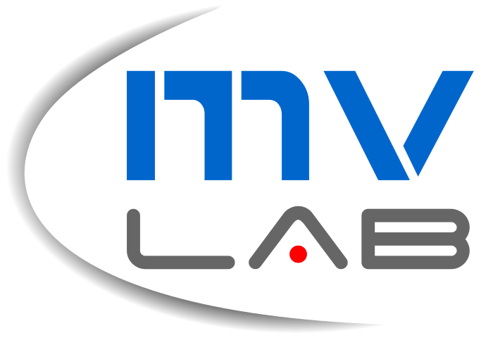
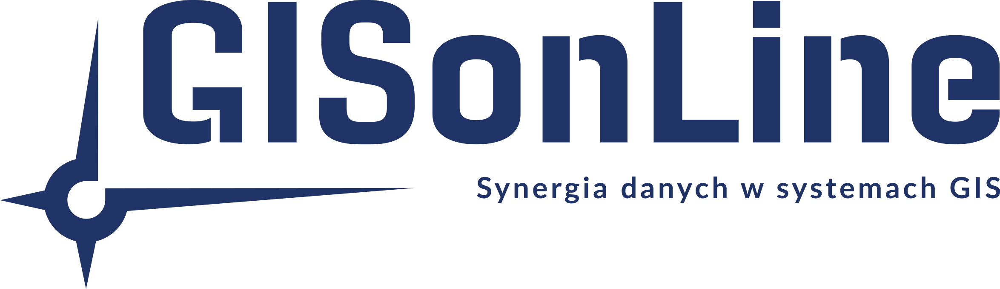

# TractionAI

Multistage system for automatic detection of railroad infrastructure elements based on machine learning solutions.

---

## Main functionality:

* **multi-stage approach** to the task of object detection,
* number of model **error prevention mechanisms**, such as dynamic object heat map, object grouping, ROI masking, 
* **automatic dataset creation** with custom auto-labeling solution and CVAT integration,
* system for **automatic validation of a multi-stage model**, determining standard metrics (AP, AP50, AP75) and mean inference times,
* optimized training of ML models,
* integration with **DronOnLine** for convenient viewing of data from a web browser.

    </th>
    </th>
    </th>

---

## Organisations involved in the project development

<table style="background-color:white">
  <tr>
    <th><a href="https://pwr.edu.pl/">Wrocław University of Science and Technology</a></th>
    <th><a href="https://mvlab.pl/">Machine Vision Laboratory</a></th>
    <th><a href="http://gisonline.pl/">GISonLine</a></th>
  </tr>
  <tr>
    <td width=33%>

</td>
    <td width=33%>

</td>
    <td width=33%>

</td>
  </tr>
</table>

